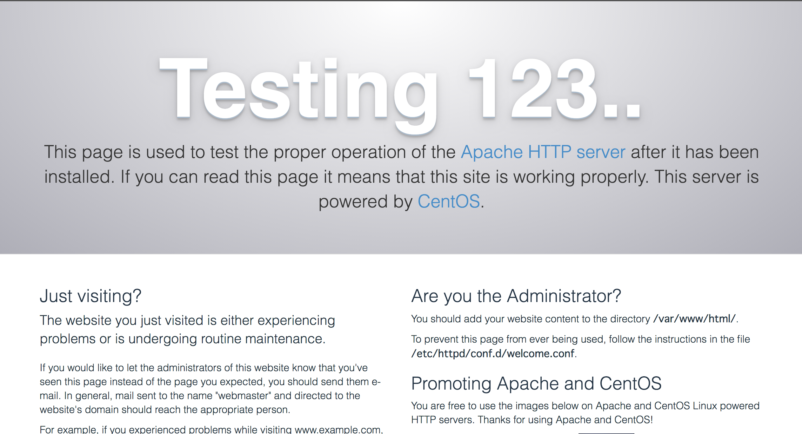
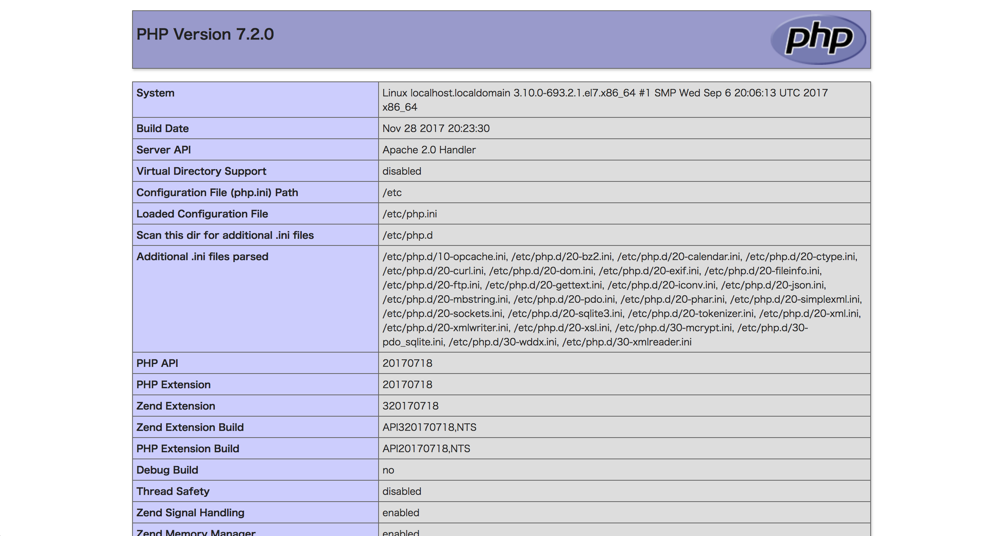

# Apache
## 概要
Apacheについて学習したことをまとめていきます。

## Apacheとは？
Apache（アパッチ）とは世界中で使用されているWebサーバーソフトウェア(HTTPサーバー)です。

## 特徴

* オープンソースソフトウェア(OSS)で、無償で誰でも利用可能
* LinuxだけでなくWindowsなど複数のサーバーOS上で利用可能

## 導入
yumからのインストールもソースからのインストールも可能です。  
今回はyumから導入してみます。

```
yum install -y httpd
```

インストールが完了しましたらバージョンを確認します。

```
$ httpd -v
Server version: Apache/2.4.6 (CentOS)
```

では実際にApacheを立ち上げてブラウザからアクセスしてみます。  
デフォルトのページが表示されればOKです。

```
$ systemctl start httpd
```



## ページを作って表示してみる
今度は実際にページを作って、ブラウザから確認してみます。  

### httpd.confファイルの特定
Apacheが外部で公開するディレクトリ（DocumentRoot）がデフォルトで設定されています。  
DocumentRoot内にファイルを設置しないと、外部へ公開できないのでDocumentRootを確認します。  

確認するにあたって、まずは読み込んでいるhttpd.confの場所を確認します。

```
$ httpd -V
(略)
-D HTTPD_ROOT="/etc/httpd"
(略)
-D SERVER_CONFIG_FILE="conf/httpd.conf"
```

上記から/etc/httpdがルートディレクトリ、設定ファイルがconf/httpd.confとなっており、   
/etc/httpd/conf/httpd.confが読み込まれている設定ファイルとわかります。

### DocumentRootの確認
では設定ファイルからDocumentRootを特定します。
/etc/httpd/conf/httpd.conf内にDocumentRootの記載があるので、それを確認します。

```
$ cat /etc/httpd/conf/httpd.conf | grep Root
(略)
# DocumentRoot: The directory out of which you will serve your
DocumentRoot "/var/www/html"
```

上記から/var/www/htmlがDocumentRootと特定できました。

### phpinfo.phpファイルを作成し、ブラウザからアクセス
ではDocumentRootも特定できたので、DocumentRoot内にphpinfo.phpファイルを作成します。

```
/var/www/html
vi phpinfo.php
```

```
<?php
phpinfo();
```

ではブラウザ上からアクセスしてみます。  
phpinfoの実行結果が表示されればOKです。

http://IP/phpinfo.php

