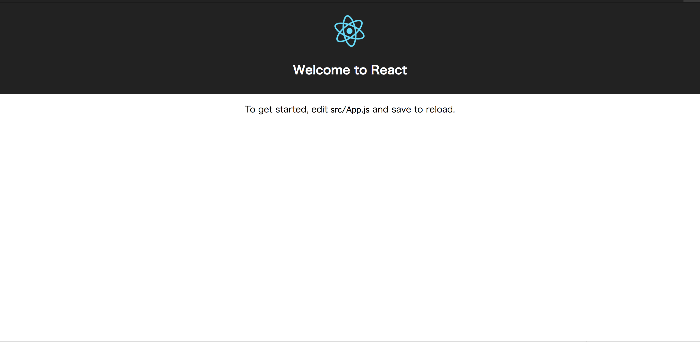

# Create React Appでお手軽にReact環境を構築
## 概要
最近のフロントエンド事情にまるでついていけていないので、Reactについて学習してみようと思いました。  
しかし、最近のフロントエンドは開発環境の構築が厄介そうでした。  
そんなときにお手軽に環境構築ができる「Create React App」と言うものがあることを知ったので、これを使って環境構築を行っていきます。

## Create React App
「Create React App」はFacebook社が開発したCLIツールで、WebpackやBabelなどを設定済みの状態で構築してくれるものです。  

### 導入
導入はnpmで行うことができます。  
※Node.jsのバージョンは4以上にしてください。

```
npm install -g create-react-app
```

これでグローバルでcreate-react-appコマンドが使えるようになります。  
では早速プロジェクトの作成を行っていきます。

```
create-react-app react-tutorial
```

これでプロジェクトの作成は完了です。

### サーバ起動
プロジェクトの作成が完了したので、ブラウザでアクセスしてみます。

```
npm start
```



これでセットアップは完了です。

## 参考資料
* React初心者が環境構築でつまづかないためのCreate React Appの始め方 - WPJ
https://www.webprofessional.jp/create-react-app/
* Facebook公式のcreate-react-appコマンドを使ってReact.jsアプリを爆速で作成する
https://qiita.com/chibicode/items/8533dd72f1ebaeb4b614