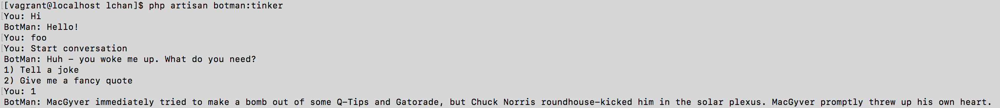

# BotMan
## 概要
BotManはPHPで使えるチャットボットフレームワークである。  
対応しているチャットツールは下記となります。

* Slack
* Telegram
* Microsoft Bot Framework
* Nexmo
* HipChat
* Facebook Messenger
* WeChat

## 動作要件
PHP7以上。  
※LaravelのBotMan Stadioを使う場合は7.1以上が必要。

## 導入方法
開発には以下目的のためBotMan Stadioを使ってみる。  
* 普段業務で使うCakePHPとの違いを確認する
* フレームワークを使うことで、メンバー間で開発しやすい

### 1. Composerでインストール
```
composer global require "botman/installer"
```

### 2. BotMan Stadioの立ち上げ
```
composer create-project --prefer-dist botman/studio weatherbot
```

## 躓き
1の手順を行ったところ下記エラーが発生。
```
Problem 1
  - botman/installer 1.0.2 requires ext-zip * -> the requested PHP extension zip is missing from your system.
  - botman/installer 1.0.1 requires ext-zip * -> the requested PHP extension zip is missing from your system.
  - botman/installer 1.0.0 requires ext-zip * -> the requested PHP extension zip is missing from your system.
  - Installation request for botman/installer ^1.0 -> satisfiable by botman/installer[1.0.0, 1.0.1, 1.0.2].
```
PHPエクステンションが足りてなかったので追加する。

```
yum install --enablerepo=remi,remi-php71 php-pecl-zi
```

## 実行
下記のコマンドを実行することで、lchan/routes/botman.phpのルーティングが適応され、対話的に実行できる。
```
php artisan botman:tinker
```


