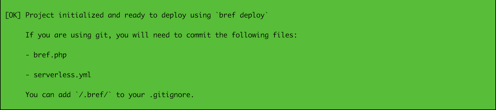
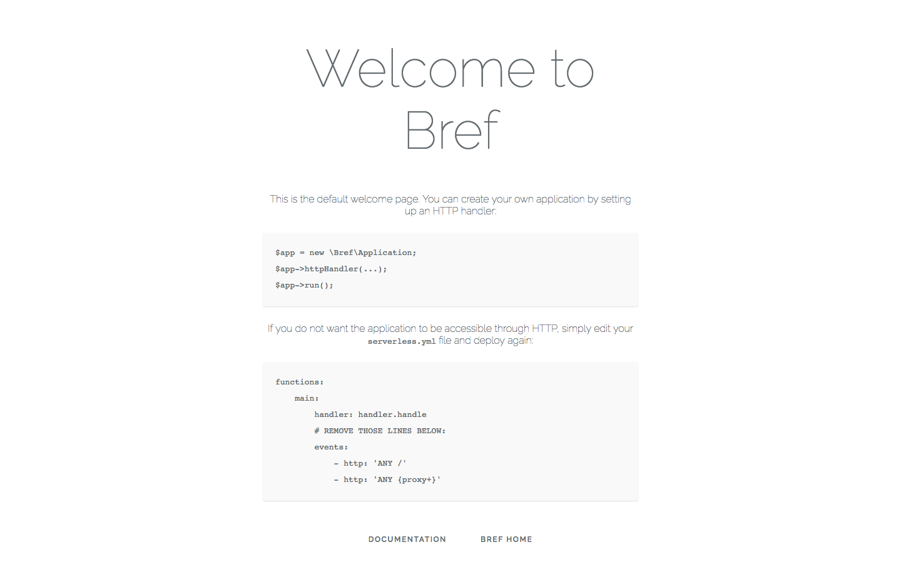

# PHPでサーバレスを始める
## 概要
re:Invent 2018で、AWSのLambdaでPHPの対応が発表されました。  
「これはPHPerとして試さねば！」と思っていたところに、[このようなライブラリ](https://github.com/mnapoli/bref)が出てきたので、早速試してみます。  

## 事前準備
事前にPHPとCompoer、Node.jsが動く環境を用意しておいてください。  
Composerが早くなるらしいので、下記のライブラリもインストールすると良さそうです。   

[composerを速くするプラグイン・prestissimoを作った: Architect Note](http://blog.tojiru.net/article/432944706.html)

## 導入
[README](https://github.com/mnapoli/bref)に従って進めます。  

### 1.serverlessの導入
```
npm install -g serverless
```

### 2.AWSの準備
Lambdaを実行できる準備をします。  
事前にアクセスキーを発行してください。  

```tips
ここで設定するアカウントはAdmin権限のものでは動きませんでした。  
IAMでLambdaの権限を与えたアカウントに設定が必要そうです。
```

```bash:awscliのインストール
# yum install -y python-pip
$ pip install awscli --user
```
awscliを導入したら、アクセスキー等を設定します。
```bash
$ aws configure
AWS Access Key ID [None]: 作ったやつを入力
AWS Secret Access Key [None]: 作ったやつを入力
Default region name [None]: ap-northeast-1
Default output format [None]: json
```
これでawsの準備はOKです。

### 3.brefを導入
```php
composer require mnapoli/bref
vendor/bin/bref init
```



initとすると下記のファイルが生成される。  
```php:bref.php
<?php declare(strict_types=1);

require __DIR__.'/vendor/autoload.php';

λ(function (array $event) {
    return [
        'hello' => $event['name'] ?? 'world',
    ];
});
```

λは下記の省略形で、本格的に書くと下記になります。
```php
$app = new \Bref\Application ; 
$app->simpleHandler(function (array $event) {
    return [
        'hello' => $event['name'] ?? 'world',
    ];
});
$app->run();
```

### 4.brefをデプロイ
先程 `init` したディレクトリ配下で、下記Commandを実行します。  
正常にデプロイが終われば準備完了です。
```
$ vendor/bin/bref deploy
Serverless: Packaging service...
(以下略)
Deployment success
 ```

 記載されているendpointにアクセスすると、下記の画面が表示されました。  
 これで準備はOKそうです。



CLIで試しに実行してみます。  
`vendor/bin/bref invoke` を実行して、 `hello world` が表示されれば問題ありません。
```
$ vendor/bin/bref invoke
{
    "hello": "world"
}
```

ちなみにローカルで実行するときは、普通にphpコマンドを実行で良さそうです。
```
$ php bref.php bref:invoke
{
    "hello": "world"
}
```

これでテスト実行は完了しました。  
`bref` は `Composer` でインストールできるので、他のライブラリやFWと連携できそうです。

## 参考

* [bref](https://github.com/mnapoli/bref)