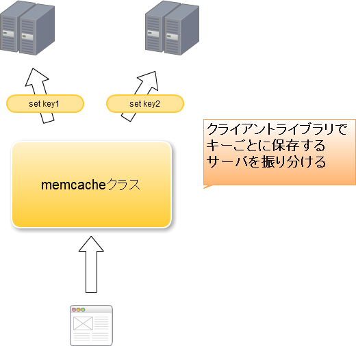

# memcachedについて
## 概要
業務で利用しているmemcachedについて学習したことをまとめていく。

## memcachedとは?
memcachedとは分散型キャッシュシステムを構築することができるソフトウェアである。  
kvsの方式でデータを保存することができ、メモリ上にデータを保存するNoSQL。

```
kvsとは?
データの保存・管理手法の一つ。
任意の値(value)に対して対応する標識(key)を設定して保存する方法。
```

## 特徴
* メモリ上にデータを保存しているため、データの書き込み・読み込みが早い。
* RDBと組み合わせる事で、RDBの読み込みの負担を軽減できる。
* クライアントライブラリで分散処理を実装できる。
* メモリ上にデータを保存しているため、memcachedの再起動を行うとデータがリセットされる。
* 設定した容量を超えると利用されないキャッシュから順番に消える(LRU)。

```
LRUとは?
未使用の時間が最も低いものを判定するアルゴリズム
```

## 分散処理について
memcachedはクライアントライブラリで分散処理を実装することが出来る。  
分散処理はキーごとにサーバを使い分けることで実現している。  
呼び出しも同様のアルゴリズムとなっている。



## memcachedを利用する上での留意点

### memcached内のデータが破損している場合は、破損したデータを読み込んでしまう
memcachedに一時的にデータを保存する場合、memcachedにデータが無い場合は直接DB等のデータを取得するように実装している事が多い（揮発性でデータが消えることは容易に考えられるため）。  
そのため、memcachedのサーバに異常があり、正常にデータが取れない場合でもサービスに大きな影響を出さなくても済む。  
しかし、memcached内のデータが破損している場合はプログラム上はmemcachedからデータを取得できるため、破損データがそのまま使われてしまう恐れがあるため、memcachedにデータを登録する際は正しいフォーマットか確認する必要がある。

## PHPのクライアントライブラリ
### memcache
#### 特徴
* PHP4.3.3以上で使用可能
* インストール時に他のライブラリに依存しない

### memcached
#### 特徴
* PHP5.2.0以上で使用可能
* インストール時にlibmemcachedモジュールが必要
* memcacheより利用できるメソッドが多いらしい

## 導入
### memcached
導入方法はソースでのインストールやyumでのインストールがある。  
今回はyumでのインストールを行う。

```
yum install -y memcached
```

### PHPライブラリ
PHPライブラリも同様にyumでインストールできる。  
サーバのPHPバージョンに合わせること。  
今回は動作確認のためにmemcacheとmemcachedの両方をインストールするが、ライブラリはどちらか一つを入れれば問題ない
```
yum install -y php72-php-pecl-memcache
yum install -y php72-php-pecl-memcached
```

あとは他のextensionと同様にphp.iniに追加する。
```
extension=memcache.so
extension=memcached.so
```
これで動くはずだったが、下記のWarningが発生した。
```
PHP Warning:  PHP Startup: Unable to load dynamic library '/usr/lib64/php/modules/memcached.so' - /usr/lib64/php/modules/memcached.so: undefined symbol: memcached_touch in Unknown on line 0
```

[こちら](http://takashi-kun.hatenablog.com/entry/2013/11/23/031343)を参考に対応し、正常に動作するようになった。

## 参考資料
PHPのMemcachedモジュールをインストール
http://takashi-kun.hatenablog.com/entry/2013/11/23/031343