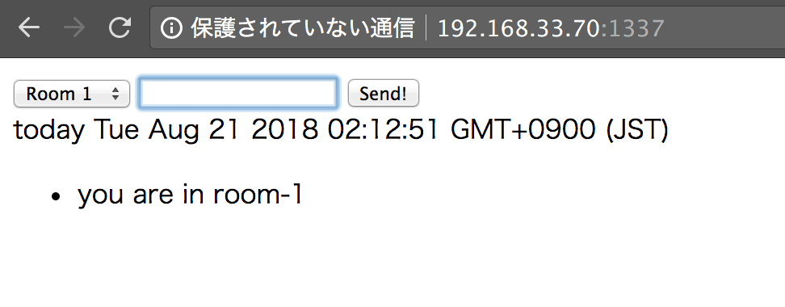

## 概要
nginxでプロキシサーバを立てられると聞いたので試してみます。  
ポートが80以外のほうがわかりやすいので、Node.jsで作ったアプリケーションを動かしてみます。  
OSはCentOS7を使います。

## 環境構築
### CentOS7にインストール
#### パッケージを登録
```bash
sudo rpm -ivh  http://nginx.org/packages/centos/7/noarch/RPMS/nginx-release-centos-7-0.el7.ngx.noarch.rpm
```

#### インストール
```bash
yum -y install nginx
```

#### インストール確認
```bash
nginx -v
```

### Node.jsで作ったアプリケーション立ち上げ
Node.jsで作ったアプリケーションを立ち上げます。  
アプリケーションは個人で作った[こちら](https://github.com/juve534/TIL/blob/master/Socket.IO/workspace/app.js)を使います。
```bash
$ node app.js
```
ひとまずブラウザでアクセス確認をします。



### nginxでプロキシサーバを設定
```bash:/etc/nginx/conf.d/backend.conf
server {
    listen      80 default;
    server_name  localhost;
    location / {
        proxy_pass http://192.168.33.70:1337;
    }
}
```

### nginxを起動
```bash
# systemctl restart nginx
```

### CLIからアクセス
```bash
# curl http://127.0.0.1
<!DOCTYPE HTML>
<html lang="ja">
<head>
    <meta charset="utf8">
    <title>Socket.IOの練習</title>
</head>
<body>
    <form id="myForm">
        <select id="rooms">
            <option value="room-1">Room 1</option>
            <option value="room-2">Room 2</option>
        </select>
        <input type="text" id="msg">
        <input type="submit" value="Send!">
        <div id="news"></div>
    </form>
    <ul id="logs"></ul>
    <script src="https://ajax.googleapis.com/ajax/libs/jquery/3.2.1/jquery.min.js"></script>
    <script src="/socket.io/socket.io.js"></script>
    <script>
    $(function() {
        var chat = io.connect('http://192.168.33.70:1337/chat'),
            news = io.connect('http://192.168.33.70:1337/news');
        $('#myForm').submit(function(e) {
            e.preventDefault();
            chat.json.emit('emit_from_client', {
                room:$('#rooms').val(),
                msg:$('#msg').val()
            });
            $('#msg').val('').focus();
        });

        chat.on('emit_from_server', function(data) {
            $('#logs').append($('<li>').text(data));
        });
        news.on('emit_from_server', function(data) {
            $('#news').text(data);
        });
    });
    </script>
</body>
</html>
```
ひとまずCLIからアクセスはできました。
ブラウザからアクセスすると、タイムアウトになるので原因はまた次の機会に調査していきます。

最後まで読んで頂きありがとうございます。


