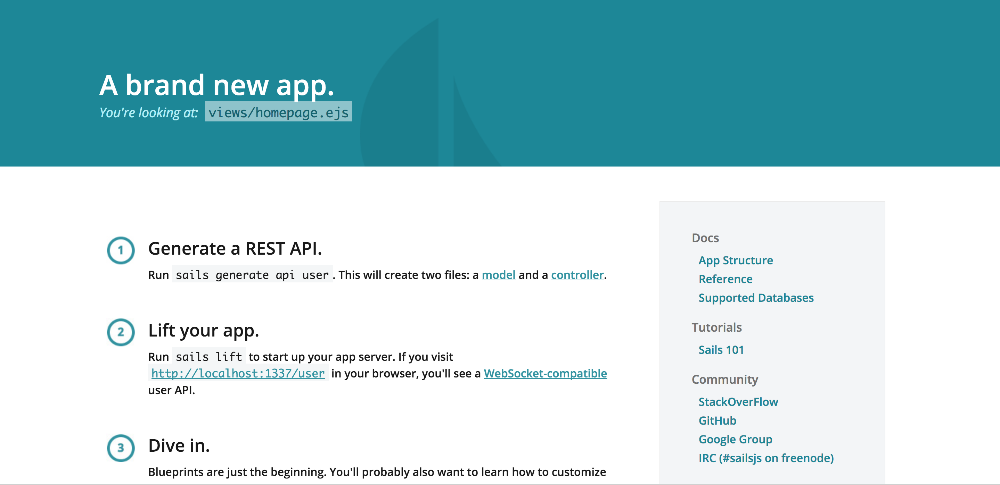

# Sails.js
## 概要
RailsライクなNode.jsのフレームワークです。    

## 導入
```
npm install sails -g
```

## プロジェクトの作成
下記コマンドでプロジェクトの作成とサーバ立ち上げが完了します。  
実行後は、http://IP:1337 にアクセスし、ページが表示されるか確認して下さい。
```
sails new sails-tutorial
cd sails-tutorial
sails lift
```
